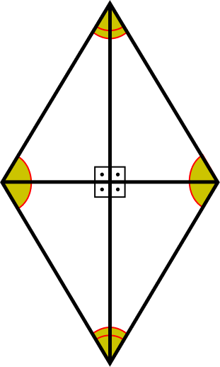

# Peaches

Imagine a guy named Felipe that want to smoke a joint and he wants to go to california from georgia and afther that he wants to go to chicago before go back to georgia. Following this way make a image in the map that looks like this: 

[](./imgs/area-do-losango-1.png)

He needs to pay the ride but the driver just accepts a jowel. A diamond with the major diagonal was 30mm and the minor diagonal was 60mm. 

Unfortunately felipe didn't have the diamong but the taxi driver was indian so what he wanted was just the diamond area in dollars.

Make a program that receaves as input the diamond diagonals and the output is the diamond area in bucks

```BAsh
## something like this
Diagonals size: 3 6
The value of this drive was 45$ bucks


```

